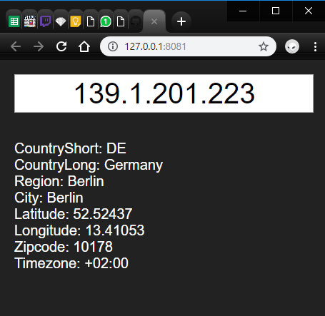

# IP 2 Geo

A simple web app that displays geographical info of IP addresses.

I made it mostly to play with mithril.js framework.

### Usage

`go get -u github.com/ww9/misc/ip2geo`

`cd $GOROOT/src/github.com/ww9/misc/ip2geo`

`go get ./... to fetch dependencies`

Download ~23mb zipped  `[DB11.LITE] IP-COUNTRY-REGION-CITY-LATITUDE-LONGITUDE-ZIPCODE-TIMEZONE Database` database file from https://lite.ip2location.com/file-download (requires login) and extract it inside `📂assets` directory as `IP2LOCATION-LITE-DB11.BIN`.

`go generate` to build assets.go

`go run .`